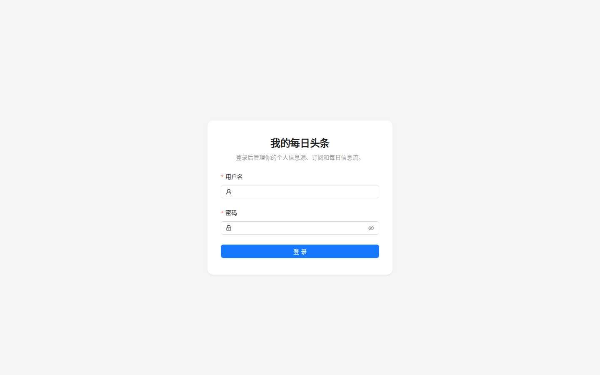
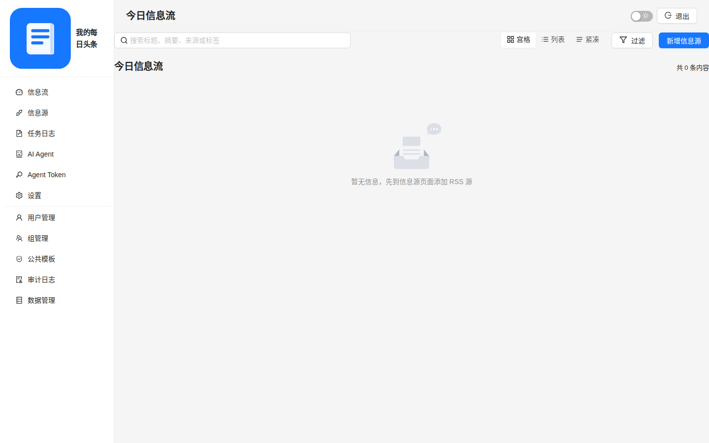
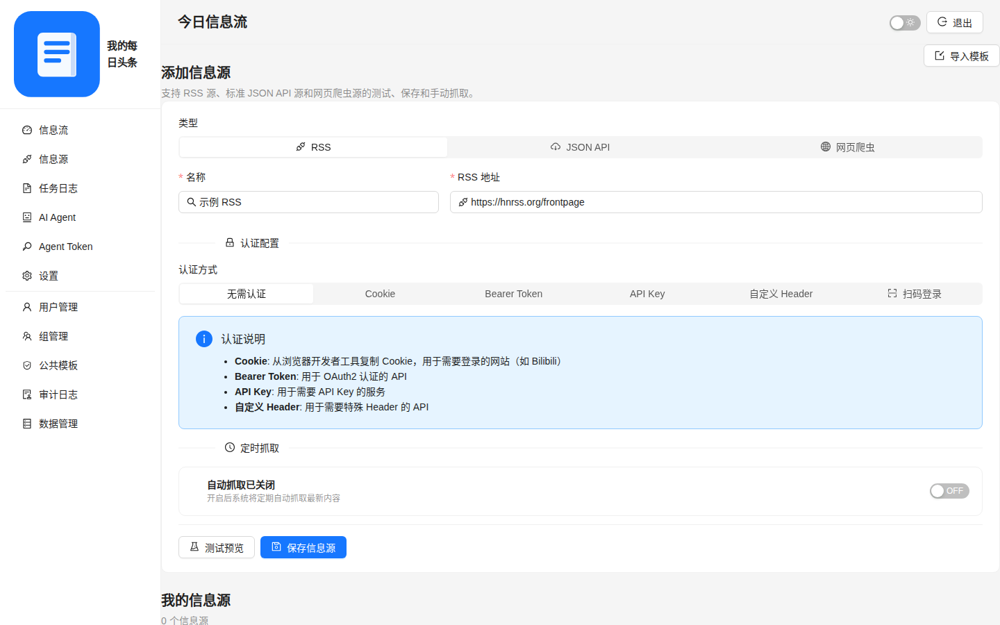
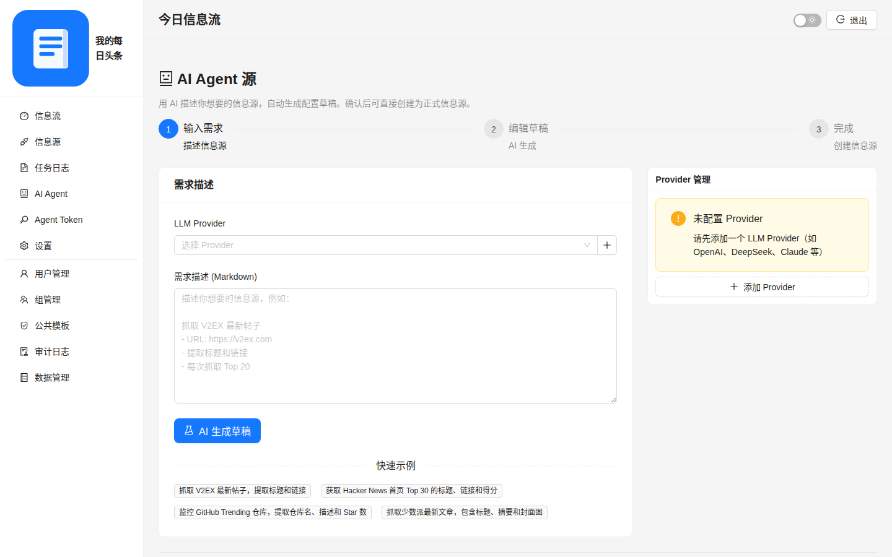
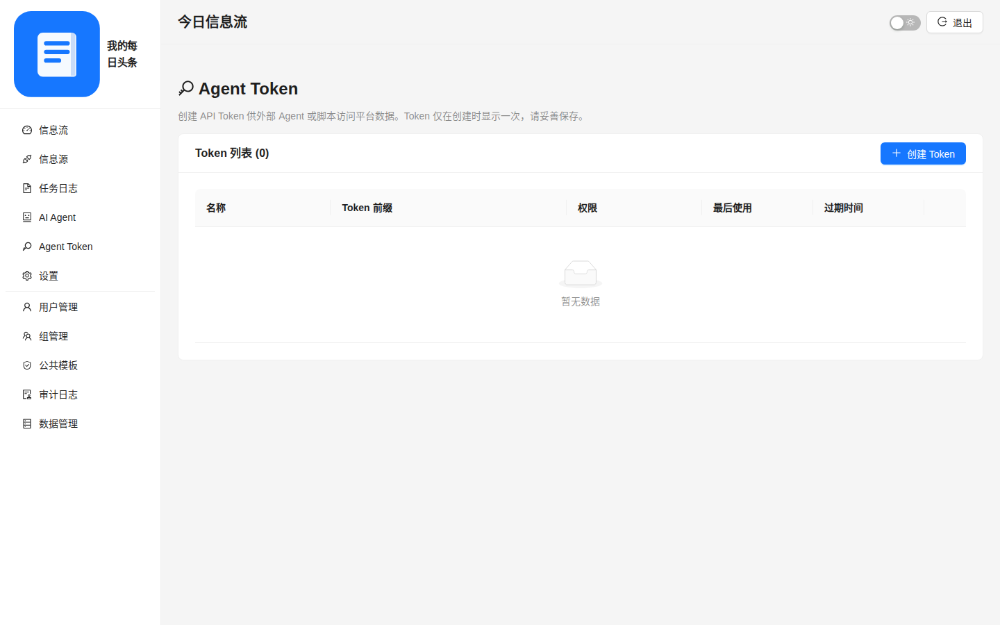
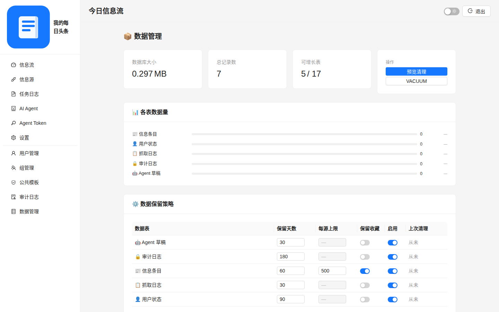
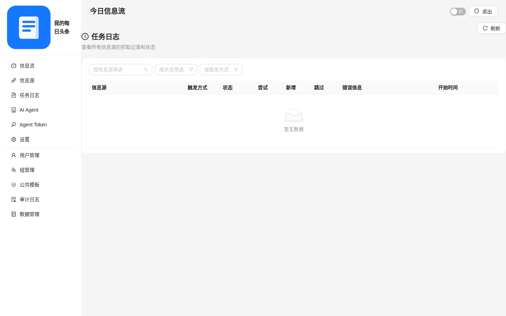
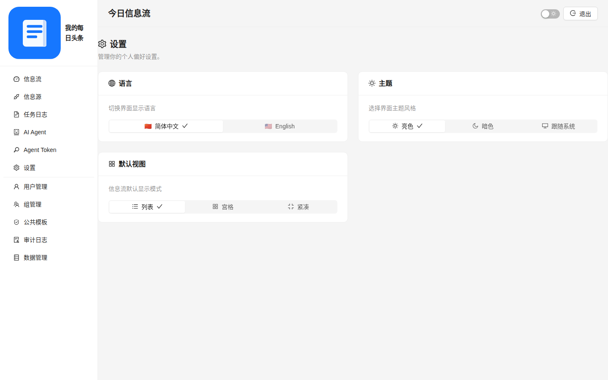

<p align="center">
  <h1 align="center">📰 我的每日头条</h1>
  <p align="center">个人信息源聚合平台 — 把你关心的内容，汇聚到一个地方</p>
</p>

<p align="center">
  
  
  
  
  
</p>

---

## ✨ 功能特性

### 📡 多源聚合
- **RSS/Atom** — 标准订阅源
- **JSON API** — 自定义字段映射的 REST API
- **网页爬虫** — CSS/XPath 选择器抓取网页内容
- **插件系统** — 可扩展的平台适配器

### 🔐 平台认证
- **二维码扫码登录** — B站、微博、小红书、今日头条
- **Cookie / Token / API Key** — 加密存储
- **自定义 Header** — 灵活的请求头配置

### 📰 信息流
- **智能去重** — 自动过滤重复内容
- **分页加载** — 无限滚动，流畅体验
- **来源筛选** — 按信源快速过滤
- **AI 摘要** — 自动提取文章核心内容
- **图片代理** — 绕过防盗链，图片正常显示

### ⏰ 定时调度
- **间隔模式** — 每 N 分钟自动抓取
- **Cron 表达式** — 精确到分钟的调度控制
- **任务日志** — 完整的抓取历史记录

### 🤖 AI Agent
- **API Token 认证** — 独立的 Agent 认证体系
- **OpenAI / Anthropic 兼容** — 支持两种 API 格式
- **推理模型支持** — MiMo 等模型的 reasoning_content 解析

### 🗄️ 数据管理
- **保留策略** — 可配置数据保留天数
- **手动清理** — 预览后执行清理
- **存储统计** — 数据量和空间使用总览

### 🛠️ 其他
- **全文搜索** — Meilisearch 驱动
- **用户管理** — JWT 认证，多用户支持
- **主题切换** — 亮色 / 暗色主题
- **中英文** — 界面国际化

---

## 📸 截图

| 登录页 | Dashboard | 信息源管理 |
|:------:|:---------:|:---------:|
|  |  |  |

| AI Agent | Agent Token | 数据管理 |
|:--------:|:-----------:|:--------:|
|  |  |  |

| 任务日志 | 设置 |
|:--------:|:----:|
|  |  |

---

## 🚀 快速开始

### 环境要求

- Python 3.11+
- Node.js 18+
- npm 或 pnpm

### 1. 克隆仓库

```bash
git clone https://github.com/SmallvL/daily-headlines.git
cd daily-headlines
```

### 2. 启动后端

```bash
cd apps/api
python3 -m venv .venv
source .venv/bin/activate
pip install -r requirements.txt

# 复制并编辑环境变量
cp .env.example .env
# 编辑 .env 设置你的密码和密钥

# 启动
uvicorn app.main:app --reload --port 8015
```

后端启动后访问 http://localhost:8015/docs 查看 API 文档。

### 3. 启动前端

```bash
cd apps/web
npm install
npm run dev
```

前端默认运行在 http://localhost:5173。

### 4. 登录

默认管理员账号：`admin`，密码在 `.env` 中设置的 `DEV_ADMIN_PASSWORD`。

---

## 🐳 Docker 部署

```bash
# 复制并编辑环境变量
cp .env.example .env
# 编辑 .env 设置所有密码

# 启动所有服务
docker compose up -d
```

默认访问地址：http://localhost

详见 [部署指南](docs/DEPLOYMENT.md)。

---

## 📁 项目结构

```
apps/
  api/                        FastAPI 后端
    app/
      core/                   配置、数据库、安全、错误处理
      modules/
        auth/                 认证（JWT 登录）
        sources/              信息源管理（CRUD、抓取、定时）
        feed/                 信息流（去重、分页、搜索）
        plugins/              插件系统 API 路由
        agent/                AI Agent 集成
        agent_tokens/         Agent Token 管理
        search/               全文搜索
        admin/                管理后台
        data_mgmt/            数据管理（保留策略、清理）
        preferences/          用户偏好设置
        proxy/                图片代理
        scheduler/            定时任务调度
      plugins/                插件系统核心
        base/                 插件基类、注册表
        bilibili/             哔哩哔哩插件
        weibo/                微博插件
        xiaohongshu/          小红书插件
        toutiao/              今日头条插件
    tests/                    后端测试
  web/                        React + Ant Design + TypeScript 前端
    src/
      features/plugins/       插件前端组件
      modules/                页面模块
      shared/                 共享 API、工具
docs/                         设计文档、部署指南
infra/                        基础设施配置
scripts/                      启动脚本
```

---

## 🔌 插件开发

### 添加新插件

1. 创建 `apps/api/app/plugins/{name}/` 目录
2. 实现以下文件：
   - `__init__.py` — 导出 `Plugin` 类
   - `auth.py` — 认证逻辑（二维码/Cookie/Token）
   - `parser.py` — 内容解析器
   - `plugin.py` — 主插件类，继承 `SourcePlugin`
3. 插件会被自动发现和注册

### 插件 API

| 方法 | 路径 | 说明 |
|------|------|------|
| `GET` | `/api/plugins` | 列出所有插件 |
| `GET` | `/api/plugins/{id}` | 插件详情 + schema |
| `POST` | `/api/plugins/{id}/auth/init` | 初始化认证 |
| `GET` | `/api/plugins/{id}/auth/qrcode/status` | 轮询二维码状态 |
| `POST` | `/api/plugins/{id}/auth/validate` | 验证凭证 |
| `POST` | `/api/plugins/{id}/fetch` | 预览抓取 |

---

## 🧪 运行测试

```bash
cd apps/api
source .venv/bin/activate
pytest tests/ -v
```

---

## 🛠️ 技术栈

| 层 | 技术 |
|----|------|
| **后端** | FastAPI + SQLAlchemy + SQLite + Alembic |
| **前端** | React 18 + Ant Design 5 + TypeScript + Vite |
| **搜索** | Meilisearch（可选） |
| **认证** | JWT + 插件化平台认证 + Fernet 加密 |
| **部署** | Docker Compose + Nginx |

---

## 📄 文档

- [软件设计](docs/SOFTWARE_DESIGN.md) — 架构设计与技术选型
- [开发计划](docs/DEVELOPMENT_PLAN.md) — 版本规划与进度
- [进度看板](docs/PROGRESS_BOARD.md) — 开发进度跟踪
- [数据管理方案](docs/DATA_MANAGEMENT_PLAN.md) — 数据保留与清理策略
- [部署指南](docs/DEPLOYMENT.md) — Docker / 手动部署

---

## 📝 License

MIT

---

## 🙏 致谢

- [FastAPI](https://fastapi.tiangolo.com/) — 现代 Python Web 框架
- [Ant Design](https://ant.design/) — 企业级 UI 组件库
- [Meilisearch](https://www.meilisearch.com/) — 轻量级全文搜索引擎
