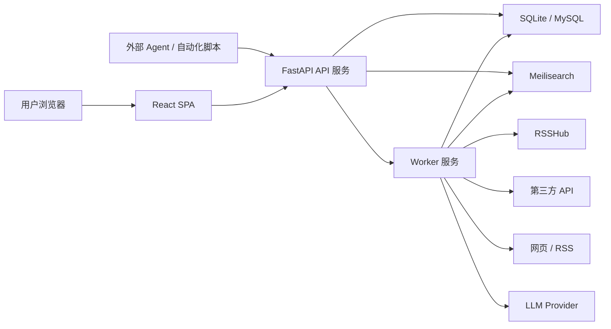
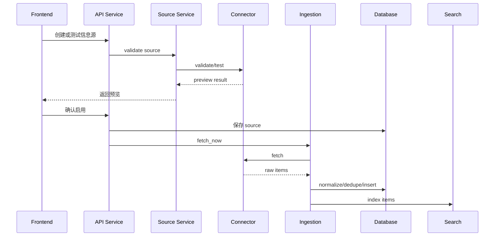

# 我的每日头条软件设计文件

## 1. 设计目标

本文件定义“我的每日头条”的软件架构、模块边界、接口契约、数据模型和并行开发规则。目标是让多个 Agent 或多个工程师可以在低耦合边界内并行开发，并让系统能够从 v0.x 平滑演进到 v1.x。

设计原则：

- 模块边界清晰，避免跨模块直接访问内部实现。
- 核心业务依赖抽象接口，不依赖具体第三方实现。
- 采集、搜索、AI、爬虫、展示相互解耦。
- 数据库从 SQLite 起步，但 schema 和 ORM 设计兼容 MySQL。
- 前端统一使用 Ant Design，不混用多套 UI 组件库。
- Scrapling 是爬虫连接器实现之一，不污染 RSS、API、RSSHub 连接器。
- AI Agent 只能生成草稿和建议，用户确认前不改变正式信息源状态。
- 外部 Agent 通过独立 token 和 scope 访问数据，不复用用户浏览器登录态。

## 2. 总体架构

### 2.1 逻辑架构



### 2.2 运行时组件

| 组件 | 职责 | 部署形态 |
| --- | --- | --- |
| Frontend | React 单页应用、Ant Design UI、路由、主题、多语言 | 静态资源或 Nginx |
| API Service | 认证、用户、信息源、订阅、搜索查询、管理接口 | FastAPI 进程 |
| Worker Service | 抓取、爬虫、AI、索引同步、定时任务 | 独立 Python 进程 |
| Database | 业务主数据 | v0.x SQLite，v1.0 可切 MySQL |
| Meilisearch | 全文搜索和过滤 | 独立服务 |
| RSSHub | 主流站点 RSS 适配 | 外部公共实例或自建 |
| LLM Provider | AI 草稿、摘要、标签 | OpenAI-compatible Provider |

### 2.3 推荐仓库结构

```text
apps/
  api/
    app/
      main.py
      core/
      modules/
      shared/
      workers/
    alembic/
    tests/
  web/
    src/
      app/
      modules/
      shared/
      routes/
      i18n/
    tests/
docs/
  DEVELOPMENT_PLAN.md
  SOFTWARE_DESIGN.md
infra/
  docker-compose.yml
  scripts/
```

## 3. 后端模块设计

每个后端模块建议包含：

```text
modules/<module_name>/
  models.py
  schemas.py
  repository.py
  service.py
  router.py
  events.py
  tests/
```

模块内部可以自由组织实现，但模块对外只能暴露 `schemas.py`、`service.py` 中明确声明的接口，以及 `router.py` 中的 HTTP API。

### 3.1 auth

职责：

- 登录。
- JWT 签发和刷新。
- 密码哈希。
- 当前用户解析。
- 用户会话上下文。
- 会话失效。

核心接口：

```python
class AuthService:
    def login(self, username: str, password: str) -> TokenPair: ...
    def refresh(self, refresh_token: str) -> TokenPair: ...
    def get_current_user(self, access_token: str) -> CurrentUser: ...
```

不负责：

- 不负责角色权限判断，权限判断归 `rbac`。
- 不负责用户资料编辑，用户资料归 `users`。
- 不负责 Agent token 的 scope 和数据接出授权，外部 Agent 访问归 `agent_access`。

### 3.2 rbac

职责：

- 角色。
- 权限。
- 用户角色。
- 组权限。
- API 权限检查。

核心接口：

```python
class PermissionService:
    def can(self, user_id: str, action: str, resource: str, context: dict) -> bool: ...
    def require(self, user_id: str, action: str, resource: str, context: dict) -> None: ...
```

不负责：

- 不直接读取 feed 条目业务字段。
- 不保存用户偏好。

### 3.3 users

职责：

- 用户资料。
- 用户状态。
- 用户偏好。
- 主题和语言设置。

核心接口：

```python
class UserService:
    def get_profile(self, user_id: str) -> UserProfile: ...
    def update_profile(self, user_id: str, payload: UserProfileUpdate) -> UserProfile: ...
    def get_preferences(self, user_id: str) -> UserPreferences: ...
    def update_preferences(self, user_id: str, payload: UserPreferencesUpdate) -> UserPreferences: ...
```

### 3.4 sources

职责：

- 信息源定义。
- 信息源模板。
- 用户订阅。
- 凭证引用。
- 定时配置。

核心接口：

```python
class SourceService:
    def create_source(self, actor: CurrentUser, payload: SourceCreate) -> SourceRead: ...
    def update_source(self, actor: CurrentUser, source_id: str, payload: SourceUpdate) -> SourceRead: ...
    def test_source(self, actor: CurrentUser, payload: SourceTestRequest) -> SourceTestResult: ...
    def subscribe(self, actor: CurrentUser, source_id: str) -> SubscriptionRead: ...
```

不负责：

- 不直接执行抓取，抓取归 `ingestion`。
- 不实现具体连接器，连接器归 `connectors`。

### 3.5 connectors

职责：

- 定义统一连接器接口。
- 实现 API、RSS、RSSHub、Scrapling、Agent、Webhook 连接器。
- 将外部数据转为标准原始结果。

统一接口：

```python
class Connector(Protocol):
    type: str

    def validate(self, config: dict, credentials: dict | None) -> ValidationResult: ...
    def test(self, config: dict, credentials: dict | None) -> SourceTestResult: ...
    def fetch(self, source: SourceRuntime, cursor: dict | None) -> FetchResult: ...
    def normalize(self, raw_items: list[dict], source: SourceRuntime) -> list[FeedItemCreate]: ...
```

连接器类型：

| 类型 | 说明 | v0.x 阶段 |
| --- | --- | --- |
| `rss` | RSS、Atom、JSON Feed | v0.2 |
| `api` | 标准 HTTP API | v0.2 |
| `rsshub` | RSSHub 路由 | v0.2 或 v0.3 |
| `scrapling` | 网页爬虫 | v0.6 |
| `agent` | AI 草稿生成的信息源 | v0.7 |
| `webhook` | 外部推送 | v1.x |

### 3.6 ingestion

职责：

- 抓取任务执行。
- 调用 connector。
- 标准化。
- 去重。
- 写入条目。
- 发布事件。
- 任务日志。

核心接口：

```python
class IngestionService:
    def fetch_now(self, actor: CurrentUser, source_id: str) -> FetchJobRead: ...
    def run_job(self, job_id: str) -> FetchJobResult: ...
    def ingest_items(self, source_id: str, items: list[FeedItemCreate]) -> IngestResult: ...
```

去重策略：

- 优先使用外部 ID。
- 其次使用 URL canonical hash。
- 再其次使用标题、来源、发布时间的组合 hash。
- 相同 dedupe key 不重复插入。

### 3.7 feed

职责：

- 信息流查询。
- 条目详情。
- 已读、收藏、隐藏。
- 标签。
- 展示状态。

核心接口：

```python
class FeedService:
    def list_items(self, actor: CurrentUser, query: FeedQuery) -> Page[FeedItemRead]: ...
    def mark_read(self, actor: CurrentUser, item_id: str) -> None: ...
    def save_item(self, actor: CurrentUser, item_id: str) -> None: ...
    def hide_item(self, actor: CurrentUser, item_id: str) -> None: ...
```

查询原则：

- 只返回用户已订阅来源或有权限访问的条目。
- 用户状态表记录个性化状态，不修改全局条目表。

### 3.8 search

职责：

- Meilisearch 索引同步。
- 搜索 API。
- 二次过滤。
- 保存搜索。
- 索引重建。

核心接口：

```python
class SearchIndexer:
    def upsert_items(self, items: list[SearchDocument]) -> None: ...
    def delete_items(self, item_ids: list[str]) -> None: ...
    def rebuild(self, source_id: str | None = None) -> RebuildJob: ...
    def sync(self, event: DomainEvent) -> None: ...

class SearchService:
    def search(self, actor: CurrentUser, query: SearchQuery) -> SearchResult: ...
```

搜索安全：

- 搜索结果必须按用户权限和订阅关系过滤。
- 搜索索引可以保存展示字段，但不能保存未加密凭证。

### 3.9 scheduler

职责：

- 调度规则解析。
- APScheduler job 注册。
- 暂停和恢复。
- 立即执行。
- 调度状态查询。

核心接口：

```python
class SchedulerService:
    def schedule_source(self, source_id: str, schedule: SourceSchedule) -> None: ...
    def pause_source(self, source_id: str) -> None: ...
    def resume_source(self, source_id: str) -> None: ...
    def trigger_now(self, source_id: str) -> FetchJobRead: ...
```

调度类型：

- `manual`
- `interval`
- `cron`
- `daily_time`

### 3.10 agent

职责：

- LLM Provider 配置。
- Agent profile。
- Markdown 需求解析。
- 工具调用。
- 信息源草稿生成。
- 草稿审计。

核心接口：

```python
class AgentService:
    def create_source_draft(self, actor: CurrentUser, request: SourceDraftRequest) -> SourceDraft: ...
    def preview_draft(self, actor: CurrentUser, draft_id: str) -> SourceTestResult: ...
    def confirm_draft(self, actor: CurrentUser, draft_id: str) -> SourceRead: ...
```

Agent 工具：

| 工具 | 功能 |
| --- | --- |
| `list_source_templates` | 列出可用模板 |
| `test_source` | 测试信息源配置 |
| `create_source_draft` | 生成信息源草稿 |
| `fetch_preview` | 抓取预览，不写正式数据 |

安全规则：

- Agent 不直接写正式信息源。
- Agent 不能读取明文凭证。
- Agent 工具受用户权限和管理员策略限制。
- Agent 调用日志写入审计。

### 3.11 agent_access

职责：

- 外部 Agent token 创建、吊销、轮换和过期管理。
- token hash 校验。
- scope 权限判断。
- Agent principal 上下文构建。
- 数据接出 API 授权。
- 同步读取和异步导出任务编排。
- token 使用审计和限流。

核心接口：

```python
class AgentAccessService:
    def create_token(self, actor: CurrentUser, payload: AgentTokenCreate) -> AgentTokenCreated: ...
    def authenticate(self, raw_token: str) -> AgentPrincipal: ...
    def require_scope(self, principal: AgentPrincipal, scope: str) -> None: ...
    def revoke_token(self, actor: CurrentUser, token_id: str) -> None: ...
    def rotate_token(self, actor: CurrentUser, token_id: str) -> AgentTokenCreated: ...

class DataExportService:
    def list_feed_items(self, principal: AgentPrincipal, query: AgentFeedQuery) -> Page[FeedItemRead]: ...
    def search_items(self, principal: AgentPrincipal, query: AgentSearchQuery) -> SearchResult: ...
    def create_export(self, principal: AgentPrincipal, payload: DataExportCreate) -> DataExportJob: ...
    def get_export(self, principal: AgentPrincipal, export_id: str) -> DataExportJob: ...
```

推荐 scope：

| Scope | 能力 |
| --- | --- |
| `feed:read` | 读取授权范围内的信息流 |
| `feed:search` | 搜索和二次过滤授权范围内的信息 |
| `sources:read` | 读取授权范围内的信息源和订阅元数据 |
| `sources:write` | 创建或更新信息源草稿 |
| `exports:create` | 创建数据导出任务 |
| `exports:download` | 下载导出结果 |
| `agent:draft` | 调用 Agent 草稿生成能力 |

数据接出格式：

- JSON：适合 API 直接消费。
- NDJSON：适合大批量流式处理。
- CSV：适合表格分析。
- OPML：适合 RSS 订阅源迁移。

不负责：

- 不签发普通用户 JWT。
- 不绕过 `rbac`、订阅关系和组权限。
- 不保存导出数据的长期副本，导出文件应有过期时间。

### 3.12 admin

职责：

- 聚合管理后台 API。
- 用户管理入口。
- 模板管理入口。
- 订阅推送入口。
- 任务和系统状态查询。

说明：

- `admin` 不应复制其他模块业务逻辑。
- `admin` 只能组合调用各模块 service。

### 3.13 audit

职责：

- 审计日志写入。
- 审计日志查询。
- 关键操作追踪。

审计范围：

- 登录失败。
- 角色变更。
- 管理员推送订阅。
- 信息源创建、修改、删除。
- 凭证更新。
- Agent 草稿确认。
- 爬虫源启用。

## 4. 前端模块设计

推荐目录：

```text
src/
  app/
    App.tsx
    router.tsx
    providers.tsx
  modules/
    auth/
    feed/
    sources/
    search/
    admin/
    settings/
  shared/
    api/
    components/
    hooks/
    types/
    utils/
  i18n/
```

### 4.1 app-shell

职责：

- 主布局。
- 顶部导航。
- 侧边栏。
- 路由守卫。
- 主题 Provider。
- 国际化 Provider。
- 全局错误边界。

### 4.2 auth-ui

职责：

- 登录页。
- 登出。
- 当前用户菜单。
- 登录态恢复。

### 4.3 feed-ui

职责：

- 首页。
- 信息流列表。
- 宫格视图。
- 紧凑列表。
- 时间线。
- 条目操作。
- 筛选面板。

关键组件：

- `FeedPage`
- `FeedToolbar`
- `FeedList`
- `FeedGrid`
- `FeedTimeline`
- `FeedItemCard`
- `FeedFilterDrawer`

### 4.4 source-ui

职责：

- 信息源列表。
- 信息源创建向导。
- 信息源编辑。
- 测试预览。
- 定时设置。
- 模板选择。

关键组件：

- `SourceListPage`
- `SourceWizard`
- `SourceTestPreview`
- `ScheduleForm`
- `TemplatePicker`

### 4.5 search-ui

职责：

- 搜索框。
- 搜索结果。
- 二次过滤。
- 保存搜索。
- 搜索历史。

### 4.6 admin-ui

职责：

- 用户管理。
- 角色管理。
- 组管理。
- 公共模板管理。
- 订阅推送。
- 任务日志。
- 审计日志。

### 4.7 settings-ui

职责：

- 个人资料。
- 主题设置。
- 语言设置。
- 首页偏好。
- AI 模型配置。
- RSSHub 实例配置。
- Agent token 管理。
- 数据导出任务管理。

## 5. 数据模型设计

### 5.1 用户和权限

| 表 | 说明 |
| --- | --- |
| `users` | 用户基础信息 |
| `roles` | 角色 |
| `permissions` | 权限点 |
| `user_roles` | 用户角色关系 |
| `groups` | 用户组 |
| `group_members` | 组成员关系 |
| `user_preferences` | 用户主题、语言、默认视图等偏好 |

字段建议：

```text
users:
  id, username, email, password_hash, avatar_url,
  status, last_login_at, created_at, updated_at, deleted_at

roles:
  id, code, name, description, is_system, created_at, updated_at

permissions:
  id, code, name, resource, action, method, path, parent_id

groups:
  id, name, description, parent_id, owner_user_id, created_at, updated_at
```

### 5.2 信息源和订阅

| 表 | 说明 |
| --- | --- |
| `sources` | 信息源定义 |
| `source_templates` | 信息源模板 |
| `source_credentials` | 凭证，加密存储 |
| `source_schedules` | 调度配置 |
| `subscriptions` | 用户订阅关系 |
| `admin_subscription_pushes` | 管理员推送记录 |

字段建议：

```text
sources:
  id, name, type, owner_type, owner_id, endpoint,
  config_json, credential_id, schedule_id,
  status, visibility, created_by, last_fetch_at,
  created_at, updated_at, deleted_at

source_templates:
  id, key, name, type, description,
  config_schema_json, default_config_json,
  handler_key, enabled, created_at, updated_at

subscriptions:
  id, user_id, source_id, status,
  settings_json, created_at, updated_at
```

### 5.3 条目和用户状态

| 表 | 说明 |
| --- | --- |
| `feed_items` | 标准化条目 |
| `feed_item_media` | 图片、视频封面等媒体 |
| `user_item_states` | 已读、收藏、隐藏、用户标签 |

字段建议：

```text
feed_items:
  id, source_id, external_id, dedupe_key,
  title, summary, content_md, url,
  author, language, published_at, fetched_at,
  raw_json, ai_meta_json, created_at, updated_at

feed_item_media:
  id, item_id, media_type, url, width, height, sort_order

user_item_states:
  id, user_id, item_id, read_at, saved_at, hidden_at, tags_json, updated_at
```

### 5.4 任务、搜索、Agent 和审计

| 表 | 说明 |
| --- | --- |
| `fetch_jobs` | 抓取任务 |
| `fetch_job_logs` | 抓取日志 |
| `source_health` | 信息源健康状态 |
| `saved_searches` | 保存搜索 |
| `agent_profiles` | 用户模型配置 |
| `agent_tasks` | Agent 任务和草稿 |
| `agent_tokens` | 外部 Agent 访问 token，服务端只保存 hash |
| `agent_token_usages` | token 使用记录、来源和最近访问 |
| `data_exports` | 数据接出任务和下载结果 |
| `crawler_recipes` | Scrapling recipe |
| `audit_logs` | 审计日志 |

字段建议：

```text
fetch_jobs:
  id, source_id, trigger_type, status,
  started_at, finished_at, error_message,
  cursor_json, metrics_json, created_at

saved_searches:
  id, user_id, name, query_json, sort_json, created_at, updated_at

agent_profiles:
  id, owner_type, owner_id, provider, model,
  api_base, api_key_encrypted, settings_json, enabled

agent_tokens:
  id, owner_user_id, name, token_prefix, token_hash,
  scopes_json, expires_at, revoked_at, last_used_at,
  rate_limit_json, allowed_ips_json, created_at, updated_at

data_exports:
  id, owner_user_id, agent_token_id, format, query_json,
  status, file_path, expires_at, row_count,
  error_message, created_at, finished_at

audit_logs:
  id, actor_user_id, action, resource_type, resource_id,
  ip, user_agent, detail_json, created_at
```

### 5.5 数据建模规则

- 业务主键使用 UUID 或 ULID。
- 所有表包含 `created_at` 和 `updated_at`。
- 可软删的表包含 `deleted_at`。
- 配置类字段可使用 JSON，但高频查询字段必须结构化。
- 凭证字段单独存储并加密，不混入普通配置。
- SQLite 中 JSON 字段按 TEXT JSON 存储。
- MySQL 中 JSON 字段按 JSON 类型存储。
- Migration 以 Alembic 为准，不依赖生产 AutoMigrate。

## 6. API 设计

### 6.1 统一响应

```json
{
  "data": {},
  "error": null,
  "request_id": "req_xxx"
}
```

错误响应：

```json
{
  "data": null,
  "error": {
    "code": "SOURCE_TEST_FAILED",
    "message": "Source test failed",
    "details": {}
  },
  "request_id": "req_xxx"
}
```

### 6.2 核心 API

认证：

```text
POST /api/auth/login
POST /api/auth/refresh
GET  /api/auth/me
POST /api/auth/logout
```

信息流：

```text
GET  /api/feed/items
GET  /api/feed/items/{id}
POST /api/feed/items/{id}/read
POST /api/feed/items/{id}/save
POST /api/feed/items/{id}/hide
PUT  /api/feed/items/{id}/tags
```

搜索：

```text
GET  /api/feed/search
GET  /api/saved-searches
POST /api/saved-searches
PUT  /api/saved-searches/{id}
DELETE /api/saved-searches/{id}
```

信息源：

```text
GET  /api/sources
POST /api/sources
GET  /api/sources/{id}
PUT  /api/sources/{id}
DELETE /api/sources/{id}
POST /api/sources/{id}/test
POST /api/sources/{id}/fetch-now
PUT  /api/sources/{id}/schedule
POST /api/sources/{id}/subscribe
DELETE /api/sources/{id}/subscribe
```

模板：

```text
GET  /api/source-templates
POST /api/admin/source-templates
PUT  /api/admin/source-templates/{id}
DELETE /api/admin/source-templates/{id}
```

Agent：

```text
GET  /api/agent/profiles
POST /api/agent/profiles
POST /api/agent/source-drafts
GET  /api/agent/source-drafts/{id}
POST /api/agent/source-drafts/{id}/preview
POST /api/agent/source-drafts/{id}/confirm
```

Agent Token 与数据接出：

```text
GET    /api/agent-access/tokens
POST   /api/agent-access/tokens
POST   /api/agent-access/tokens/{id}/rotate
DELETE /api/agent-access/tokens/{id}
GET    /api/agent-access/me
GET    /api/agent-access/feed/items
GET    /api/agent-access/feed/search
GET    /api/agent-access/sources
POST   /api/agent-access/exports
GET    /api/agent-access/exports
GET    /api/agent-access/exports/{id}
GET    /api/agent-access/exports/{id}/download
```

认证方式：

```text
Authorization: Bearer <agent_token>
```

说明：

- `GET /api/agent-access/me` 用于外部 Agent 校验 token、获取 owner、scope 和限制。
- token 不换取普通用户 JWT，不创建浏览器 session。
- 所有 agent-access API 必须执行 scope、用户授权范围、速率限制和审计。

管理后台：

```text
GET  /api/admin/users
PUT  /api/admin/users/{id}
GET  /api/admin/roles
GET  /api/admin/groups
POST /api/admin/subscription-pushes
GET  /api/admin/fetch-jobs
GET  /api/admin/audit-logs
```

### 6.3 API 兼容策略

- v0.x 可快速迭代，但同一版本内不破坏前端依赖。
- v1.0 后新增字段必须向后兼容。
- 删除字段必须先废弃一个小版本。
- 错误码稳定，错误文案可国际化。

## 7. 事件与解耦

### 7.1 事件类型

| 事件 | 触发时机 | 订阅者 |
| --- | --- | --- |
| `SourceCreated` | 信息源创建 | audit、scheduler |
| `SourceUpdated` | 信息源更新 | audit、scheduler |
| `SubscriptionChanged` | 订阅变更 | feed、notification |
| `FetchJobStarted` | 抓取开始 | audit、monitoring |
| `FeedItemsCreated` | 新条目写入 | search、notification |
| `FeedItemUpdated` | 条目更新 | search |
| `SourceHealthChanged` | 健康状态变化 | notification、admin |
| `AgentDraftConfirmed` | Agent 草稿确认 | sources、audit |
| `AgentTokenCreated` | Agent token 创建 | audit |
| `AgentTokenRevoked` | Agent token 吊销 | audit |
| `DataExportRequested` | 数据接出任务创建 | audit、worker |
| `DataExportCompleted` | 数据接出任务完成 | audit、notification |

### 7.2 事件格式

```json
{
  "id": "evt_xxx",
  "type": "FeedItemsCreated",
  "occurred_at": "2026-05-28T00:00:00Z",
  "actor_id": "user_xxx",
  "resource_type": "feed_item",
  "resource_ids": ["item_xxx"],
  "payload": {}
}
```

### 7.3 v0.x 和 v1.x 实现

- v0.x：进程内事件总线即可。
- v1.0：保留事件表，支持失败重试和索引重建。
- v1.x：可替换为 Redis Stream、RabbitMQ 或其他消息队列。

## 8. 连接器设计

### 8.1 连接器生命周期



### 8.2 标准 FeedItemCreate

```python
class FeedItemCreate(BaseModel):
    source_id: str
    external_id: str | None = None
    title: str
    summary: str | None = None
    content_md: str | None = None
    url: str | None = None
    image_url: str | None = None
    author: str | None = None
    language: str | None = None
    published_at: datetime | None = None
    raw_json: dict = Field(default_factory=dict)
```

### 8.3 Scrapling 边界

Scrapling connector 只负责网页抓取，不负责业务订阅、用户权限、搜索索引和 AI 决策。

默认安全策略：

- 只允许抓取用户配置的域名。
- 默认限制并发。
- 默认设置超时。
- 默认限制单次最大页数和最大条目数。
- 动态页面抓取必须由 worker 执行。
- 预览模式不写正式条目。
- 高风险能力必须由管理员开启。

## 9. 搜索设计

### 9.1 搜索文档

```json
{
  "id": "item_xxx",
  "source_id": "source_xxx",
  "owner_user_ids": ["user_xxx"],
  "title": "标题",
  "summary": "摘要",
  "content": "正文",
  "author": "作者",
  "source_name": "来源",
  "tags": ["AI", "新闻"],
  "language": "zh-CN",
  "has_image": true,
  "published_at": 1770000000,
  "fetched_at": 1770000300
}
```

### 9.2 权限过滤

- 搜索 API 先根据当前用户构造可见 source 范围。
- Meilisearch 查询必须附加 source 或 owner 过滤。
- 用户私有状态，如已读和收藏，可在主库中二次合并。

### 9.3 索引恢复

- 提供全量 rebuild。
- 提供按 source rebuild。
- 提供按 item upsert。
- 搜索不可用时，feed 基础查询仍应可用。

## 10. 调度和 Worker 设计

### 10.1 Worker 职责

- 执行抓取。
- 执行 Scrapling 动态页面抓取。
- 执行 AI 任务。
- 执行搜索索引同步。
- 处理失败重试。

### 10.2 任务状态

| 状态 | 说明 |
| --- | --- |
| `pending` | 等待执行 |
| `running` | 执行中 |
| `success` | 成功 |
| `failed` | 失败 |
| `cancelled` | 取消 |
| `skipped` | 因频率或策略跳过 |

### 10.3 失败处理

- 网络失败可重试。
- 配置错误不重试，标记 source 需要用户处理。
- 权限失败不重试，提示凭证失效。
- 多次失败后降低频率或暂停建议。

## 11. 安全设计

### 11.1 认证和权限

- JWT access token 短有效期。
- refresh token 可轮换。
- 管理接口必须校验管理员角色。
- 资源访问必须校验 owner、subscription 或 group。

### 11.2 凭证管理

- API key、Cookie、LLM key 单独存储。
- 凭证加密后入库。
- 前端不回显完整凭证。
- Agent 不能读取明文凭证。

### 11.3 Agent Token 安全

- Agent token 创建后只展示一次。
- 服务端只保存 token hash 和短 prefix，不能从数据库还原明文 token。
- token 必须设置 scope，默认最小权限。
- token 支持过期时间、吊销、轮换和最近使用时间。
- 可选限制 IP allowlist、每分钟请求数、每日导出量。
- token 不能换取普通用户 JWT，也不能访问浏览器 session 专用接口。
- 数据接出必须执行用户可见范围过滤，不能绕过订阅、组权限和管理员策略。
- 大批量导出必须异步执行，并设置结果文件过期时间。
- 每次 token 认证失败、成功使用、导出创建和下载都写入审计日志。

### 11.4 爬虫安全

- 默认遵守域名边界。
- 默认限制速率、并发、超时。
- 管理员可禁用 Scrapling 动态页面能力。
- 不默认支持验证码绕过。
- 不默认支持未授权内容抓取。

### 11.5 审计

- 管理操作写入 audit。
- Agent 草稿确认写入 audit。
- Agent token 创建、吊销、轮换写入 audit。
- 数据接出任务创建和下载写入 audit。
- 爬虫源启用写入 audit。
- 凭证更新写入 audit，但不记录明文凭证。

## 12. 国际化和主题

### 12.1 前端国际化

- 所有菜单、按钮、表单、错误、空状态使用 i18n key。
- 默认支持 `zh-CN` 和 `en-US`。
- Ant Design locale 跟随用户语言。
- 日期和时间格式跟随语言。

### 12.2 后端错误码

后端返回稳定错误码，前端映射为多语言文案。

示例：

```text
AUTH_INVALID_CREDENTIALS
SOURCE_TEST_FAILED
SOURCE_RATE_LIMITED
FETCH_JOB_FAILED
AGENT_PROVIDER_UNAVAILABLE
AGENT_TOKEN_INVALID
AGENT_TOKEN_SCOPE_DENIED
DATA_EXPORT_LIMIT_EXCEEDED
PERMISSION_DENIED
```

### 12.3 主题

- 使用 Ant Design token。
- 支持 light、dark、system。
- 用户偏好持久化。
- 不允许模块自定义一套独立颜色系统。

## 13. 多 Agent 并行开发规则

### 13.1 模块所有权

| 模块 | Owner Agent | 可修改范围 |
| --- | --- | --- |
| `auth` | Auth RBAC Agent | auth models、schemas、service、router、tests |
| `rbac` | Auth RBAC Agent | rbac models、policy、permission checks |
| `sources` | Source Agent | source schema、template、subscription |
| `connectors` | Connector Agent | connector interface 和各实现 |
| `ingestion` | Ingestion Agent | job、dedupe、normalization |
| `feed` | Feed Agent | feed query、item state |
| `search` | Search Agent | indexer、search API、saved searches |
| `scheduler` | Scheduler Agent | schedule service、worker trigger |
| `agent` | AI Agent | LLM profile、draft、tools |
| `agent_access` | Agent Access Agent | token、scope、数据接出授权 |
| `data_exports` | Data Export Agent | 导出任务、格式转换、下载 |
| `admin` | Admin Agent | 管理端组合 API |
| `web/feed` | Feed UI Agent | 首页和条目组件 |
| `web/sources` | Source UI Agent | 信息源向导和设置 |
| `web/admin` | Admin UI Agent | 管理后台页面 |

### 13.2 协作规则

- 修改公共 schema 前先更新设计文档或 OpenAPI。
- 后端跨模块调用必须通过 service interface。
- 前端跨模块共享逻辑必须放在 `shared`。
- 不允许为了当前模块方便直接改另一个模块内部 repository。
- 每个模块 PR 必须包含测试或说明为什么暂不测试。
- 每个 Agent 提供 mock 数据，方便其他 Agent 并行开发。

### 13.3 集成顺序

1. 冻结基础目录和配置。
2. 冻结核心数据库 migration。
3. 冻结 OpenAPI 草案。
4. 冻结事件契约。
5. 并行实现模块。
6. 合并前跑模块测试。
7. 合并后跑 API 和 E2E smoke test。

## 14. 测试策略

### 14.1 后端测试

- 单元测试：
  - connector。
  - service。
  - schema validation。
  - dedupe。
  - schedule parser。
- API 测试：
  - 登录。
  - 权限。
  - 信息源 CRUD。
  - 搜索。
  - 订阅。
  - 管理后台。
- 集成测试：
  - SQLite。
  - MySQL。
  - Meilisearch。
  - RSS fixture。
  - Scrapling fixture。

### 14.2 前端测试

- 组件测试：
  - 首页条目卡片。
  - 筛选器。
  - 信息源向导。
  - 定时设置表单。
  - 主题切换。
- 页面测试：
  - 登录页。
  - 首页。
  - 信息源列表。
  - 管理后台。
- E2E：
  - 登录。
  - 创建 RSS 源。
  - 手动抓取。
  - 搜索过滤。
  - 管理员推送。
  - 普通用户接受订阅。

### 14.3 验收测试数据

每个模块应提供：

- 最小 fixture。
- 正常样例。
- 错误样例。
- 权限边界样例。
- 中文内容样例。

## 15. 部署设计

### 15.1 v0.x 开发部署

```text
Frontend dev server
FastAPI dev server
SQLite file
Meilisearch local service
Worker local process
```

### 15.2 v1.0 推荐部署

```text
Nginx
Frontend static files
FastAPI API container
Worker container
MySQL container or managed MySQL
Meilisearch container
Optional RSSHub container
```

### 15.3 配置项

```text
APP_ENV
APP_SECRET_KEY
DATABASE_URL
MEILISEARCH_URL
MEILISEARCH_API_KEY
RSSHUB_BASE_URL
CREDENTIAL_ENCRYPTION_KEY
LLM_DEFAULT_PROVIDER
LLM_DEFAULT_MODEL
SCRAPLING_DYNAMIC_ENABLED
CRAWLER_MAX_CONCURRENCY
CRAWLER_DEFAULT_TIMEOUT_SECONDS
```

## 16. 版本演进边界

### 16.1 v0.x 可变部分

- UI 布局。
- API 字段的非核心命名。
- 模板 schema。
- Agent prompt。
- Scrapling recipe 格式。

### 16.2 v1.0 后应稳定部分

- 用户和权限模型。
- Source、Subscription、FeedItem 核心字段。
- Connector 接口。
- Search API。
- Scheduler API。
- Agent token 认证头、scope 命名和数据接出 API。
- 事件类型。
- 错误码。

### 16.3 v1.x 扩展点

- MCP Server。
- 插件系统。
- 第三方通知渠道。
- 多租户。
- 移动端。
- 推荐算法。
- 内容聚类。

扩展点必须依赖接口，不得绕过现有模块边界直接访问内部表。

## 17. 开发完成定义

一个模块完成必须满足：

- 有清晰 API 或 service interface。
- 有数据模型或明确说明无需数据模型。
- 有单元测试或 API 测试。
- 有 mock 数据。
- 有错误处理。
- 有权限边界。
- 有文档更新。
- 不引入跨模块隐式依赖。

一个版本完成必须满足：

- 版本验收标准全部通过。
- E2E smoke test 通过。
- 数据库 migration 可从空库执行。
- 关键页面无明显布局问题。
- 亮色和暗色模式核心页面可用。
- 中文和英文核心页面可用。
